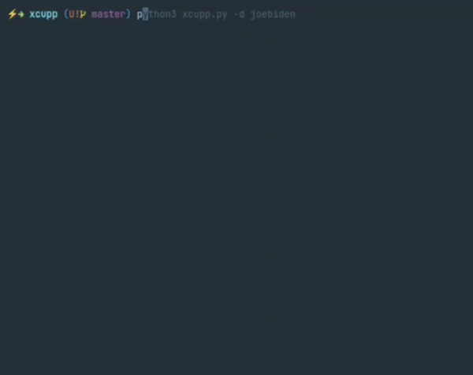
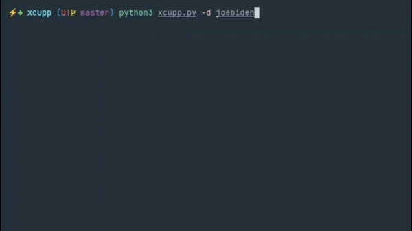

# X-CUPP - eXtended - Common User Passwords Profiler

## About

  The most common form of authentication is the combination of a username
  and a password or passphrase. If both match values stored within a locally
  stored table, the user is authenticated for a connection. Password strength is
  a measure of the difficulty involved in guessing or breaking the password
  through cryptographic techniques or library-based automated testing of
  alternate values.

  A weak password might be very short or only use alphanumberic characters,
  making decryption simple. A weak password can also be one that is easily
  guessed by someone profiling the user, such as a birthday, nickname, address,
  name of a pet or relative, or a common word such as God, love, money or password.

  That is why X-CUPP was born, and it can be used in situations like legal
  penetration tests or forensic crime investigations.

Requirements
------------

You need Python 3 to run X-CUPP.

Quick start
-----------

    $ python3 xcupp.py -h

## Options

  Usage: xcupp.py [OPTIONS]

        -h      this menu

        -i      Interactive questions for user password profiling

        -d      Use default options without interactive questions, requiring a name

        -v      Version of the program

## Configuration

   X-CUPP has configuration file xcupp.cfg with instructions.

## Example (Fast forwarded)

## License

  This program is free software; you can redistribute it and/or modify
  it under the terms of the GNU General Public License as published by
  the Free Software Foundation; either version 3 of the License, or
  any later version.

  This program is distributed in the hope that it will be useful,
  but WITHOUT ANY WARRANTY; without even the implied warranty of
  MERCHANTABILITY or FITNESS FOR A PARTICULAR PURPOSE.  See the
  GNU General Public License for more details.

  You should have received a copy of the GNU General Public License
  along with this program; if not, write to the Free Software
  Foundation, Inc., 59 Temple Place, Suite 330, Boston, MA  02111-1307  USA

  See './LICENSE' for more information.

## Credits

This tool was originally designed and developed by [Mebus](https://github.com/Mebus). You can find the original repository [here](https://github.com/Mebus/cupp.git).

- Muris Kurgas (aka j0rgan)
  - Email: j0rgan@remote-exploit.org
  - Website: [Remote Exploit](http://www.remote-exploit.org), [Azuzi.me](http://www.azuzi.me)

- Bosko Petrovic (aka bolexxx)
  - Email: bole_loser@hotmail.com
  - Website: [Offensive Security](http://www.offensive-security.com), [Bolexxx.net](http://www.bolexxx.net)

- [Abhro](https://github.com/Abhro/)

- [codepr](https://github.com/codepr)

- [quantumcore](https://github.com/quantumcore)

## Important Note

Cupp is capable of generating a comprehensive list of potential passwords based on personal information. However, it's essential to be aware that using Cupp with default settings may result in the generation of a significant number of passwords.

Depending on the complexity of the input data and the size of the wordlists generated, it's possible to end up with a large list of passwords. Therefore, exercise caution when using Cupp and consider adjusting the settings or providing specific input parameters to control the output size, especially when dealing with large datasets.

We recommend reviewing and filtering the generated wordlists to ensure they meet your specific requirements and usage scenarios. Additionally, consider the potential implications of using such extensive wordlists, especially in security testing and password auditing scenarios.

## Github import

This project was imported into https://github.com/Mebus/cupp by Mebus from:  
http://www.remote-exploit.org/content/x-cupp-3.0.tar.gz  
http://www.remote-exploit.org/articles/misc_research__amp_code/index.html  
to encourage further development of the tool.
